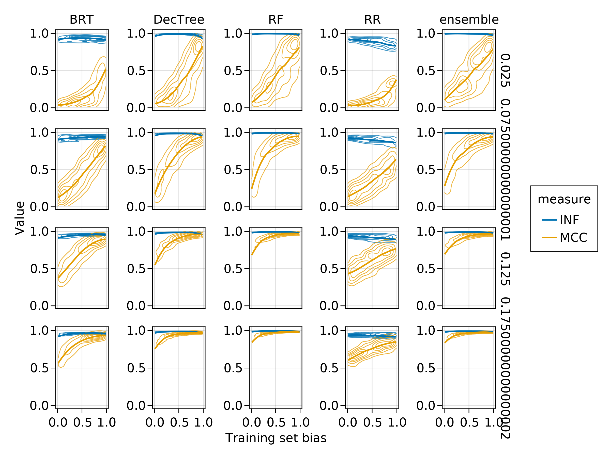
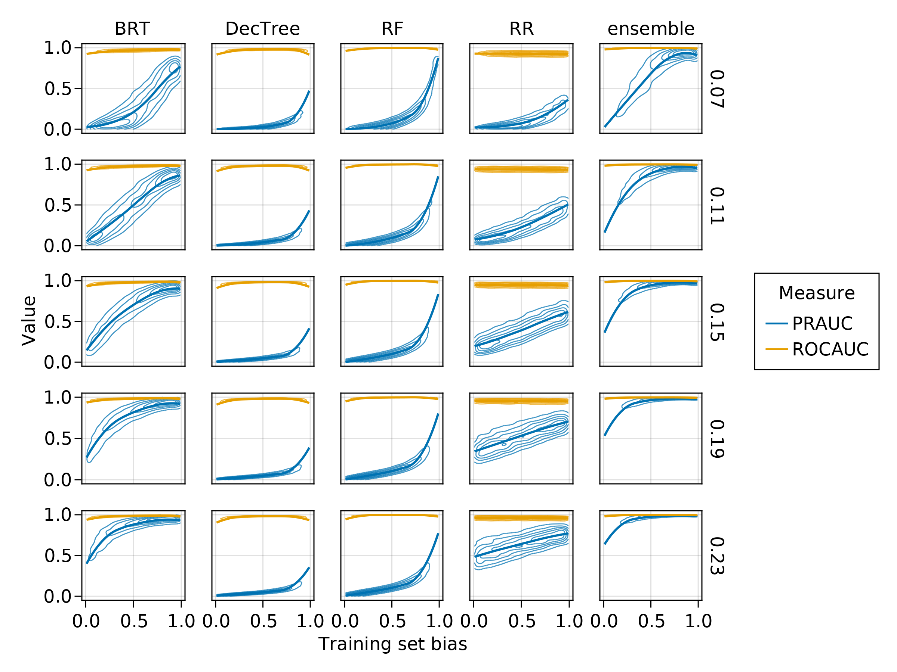
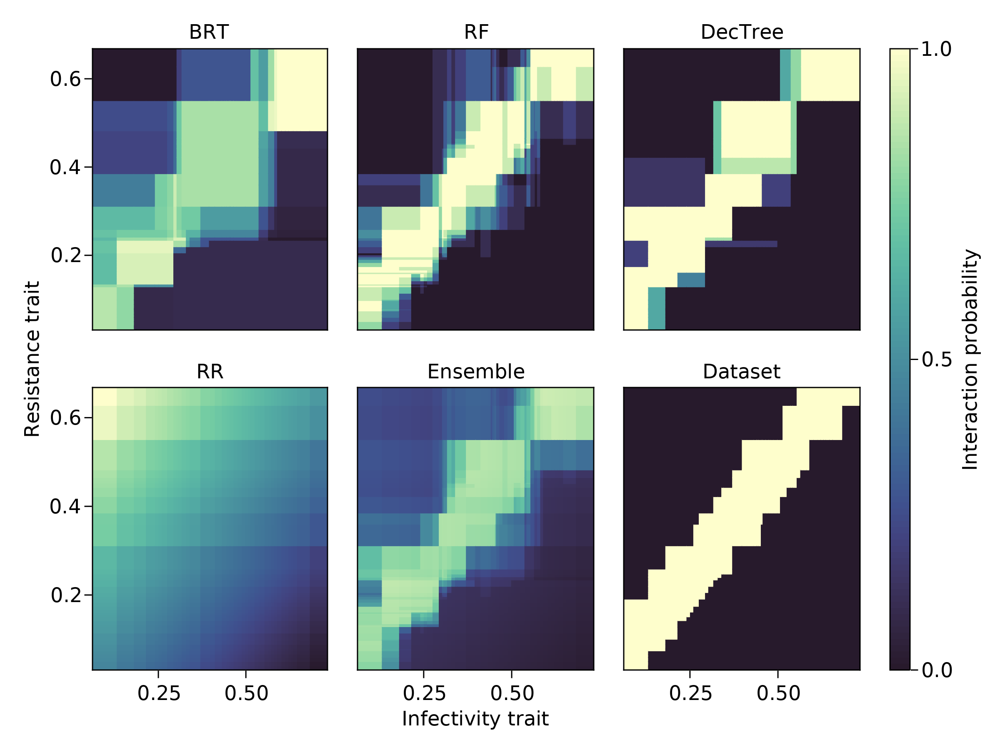

- example on diagnostic test: rare events are hard to detect even with really good models
- summary of model challenges for networks
- @Strydom2021RoaPre importance of drawing on traits + validation is challenging + comparing across space

Binary classifiers are usually assessed by measuring properties of their
confusion matrix, *i.e.* the contingency table reporting true/false
positive/negative hits. A confusion matrix is laid out as

$$\begin{pmatrix}
    \text{tp} & \text{fp} \\
    \text{fn} & \text{tn}
\end{pmatrix} \,,$$

wherein $\text{tp}$ is the number of interactions predicted as positive,
$\text{tn}$ is the number of non-interactions predicted as negative, $\text{fp}$
is the number of non-interactions predicted as positive, and $\text{fn}$ is the
number of interactions predicted as negative. Almost all measures based on the
confusion matrix express rates of error or success as proportions, and therefore
the values of these components matter in a *relative* way. At a coarse scale, a
classifier is *accurate* when the trace of the matrix divided by the sum of the
matrix is close to 1, with other measures focusing on different ways in which
the classifer is wrong.

The same approach is used to evaluate *e.g.* species distribution models (SDMs).
Indeed, the training and evaluation of SDMs as binary classifiers suffers from
the same issue of low prevalence. In a previous work, @Allouche2006AssAcc
suggested that $\kappa$ was a better test of model performance than the True
Skill Statistic (TSS), which we will refer to as Youden's informedness (or $J$);
these conclusions were later criticized by @Somodi2017PreDep, who emphasized
that informedness' relationship to prevalence depends on assumptions about bias
in the model, and therefore recommend the use of $\kappa$ as a validation of
classification performance. Although this work offers recommendations about the
comparison of models, it doesn't establishes baselines or good practices for
training on imbalanced ecological data. Within the context of networks, there
are three specific issues that need to be adressed. First, what values of
performance measures are we expecting for a classifier that has poor
performance? This is particularly important as it can evaluate whether low
prevalence can lull us into a false sense of predictive accuracy. Second,
independently of the question of model evaluation, is low prevalence an issue
for *training*, and can we remedy it? Finally, because the low amount of data on
interaction makes a lot of imbalance correction methods [see *e.g.*
@Branco2015SurPre] hard to apply, which indicators can be optimized with the
least amount of positive interaction data?

In addition to the literature on SDMs, most of the research on machine learning
application to life sciences is focused on genomics [which has very specific
challenges, see a recent discussion by @Whalen2021NavPit]; this sub-field has
generated largely different recommendations. @Chicco2020AdvMat suggest using
Matthews correlation coefficient (MCC) over $F_1$, as a protection against
over-inflation of predicted results; @Delgado2019WhyCoh advocate against the use
of Cohen's $\kappa$, again in favor of MCC, as the relative nature of $\kappa$
means that a worse classifier can be picked over a better one; similarly,
@Boughorbel2017OptCla recommend MCC over other measures of performance for
imbalanced data, as it has more desirable statistical properties. More recently,
@Chicco2021MatCor temper the apparent supremacy of the MCC, by suggesting it
should be replaced by Youden's informedness (also known as $J$, bookmaker's
accuracy, and the True-Skill Statistic) when the imbalance in the dataset may
not be representative [which is the case as networks are under-sampled;
@Jordano2016SamNet; @Jordano2016ChaEco], when classifiers need to be compared
across different datasets [for example when predicting a system in space, where
undersampling varies locally; @McLeod2021SamAsy], and when comparing the results
to a no-skill (baseline) classifier is important. As these conditions are likely
to be met with network data, there is a need to evaluate which measures of
classification accuracy respond in a desirable way.

A lot of binary classifiers are built by using a regressor (whose task is to
guess the value of the interaction, amd can therefore return somethins
considered to be a pseudo-probability); in this case, the optimal value below
which predicitions are assumed to be negative (*i.e.* the interaction does not
exist) can be determined by picking a threshold maximizing some value on the ROC
curve or the PR curve. The area under these curves (ROC-AUC and PR-AUC
henceforth) give ideas on the overall goodness of the classifier.
@Saito2015PrePlo established that the ROC-AUC is biased towards over-estimating
performance for imbalanced data; on the contrary, the PR-AUC is able to identify
classifiers that are less able to detect positive interactions correctly, with
the additional advantage of having a baseline value equal to prevalence.
Therefore, it is important to assess whether these two measures return different
results when applied to ecological network prediction.

We establish that due to the low prevalence of interactions, even poor
classifiers applied to food web data will reach a high accuracy; this is because
the measure is dominated by the accidental correct predictions of negatives. The
$F_1$ score and positive predictive values are less sensitive to bias, but
**TODO**

# Baseline values

Intro

## Definition of the performance measures

$\kappa$

$F_{\beta}$

informedness

MCC

ROC-AUC

PR-AUC

## Confusion matrix with skill and bias

In this section, we will assume a network of connectance $\rho$, *i.e.* having
$\rho S^2$ interactions (where $S$ is the species richness), and $(1-\rho) S^2$
non-interactions. Therefore, the vector describing the *true* state of the
network is a column vector $\mathbf{o}^T = [\rho (1-\rho)]$ (we can safely drop
the $S^2$ terms, as we will work on the confusion matrix, which ends up
expressing *relative* values).

In order to write the values of the confusion matrix for a hypothetical
classifier, we need to define two characteristics: its skill, and its bias.
Skill, here, refers to the propensity of the classifier to get the correct
answer (*i.e.* to assign interactions where they are, and to not assign them
where they are not). A no-skill classifier guesses at random, *i.e.* it will
guess interactions with a probability $\rho$. The predictions of a no-skill
classifier can be expressed as a row vector $\mathbf{p} = [\rho (1-\rho)]$. The
confusion matrix $\mathbf{M}$ for a no-skill classifier is given by the
element-wise product of these vectors $\mathbf{o} \odot \mathbf{p}$, *i.e.*

$$
\mathbf{M} = \begin{pmatrix}
    \rho^2 & \rho (1-\rho) \\
    (1-\rho) \rho & (1-\rho)^2
\end{pmatrix} \,.
$$

In order to regulate the skill of this classifier, we can define a skill matrix
$\mathbf{S}$ with diagonal elements equal to $s$, and off-diagonal elements
equal to $(1-s)$, and re-express the skill-adjusted confusion matrix as
$\mathbf{M} \odot \mathbf{S}$, *i.e.*

$$
\begin{pmatrix}
    \rho^2 & \rho (1-\rho) \\
    (1-\rho) \rho & (1-\rho)^2
\end{pmatrix} \odot \begin{pmatrix}
    s & (1-s) \\
    (1-s) & s
\end{pmatrix} \,.
$$

Note that when $s=0$, $\text{Tr}(\mathbf{M}) = 0$ (the classifier is *always*
wrong), when $s=0.5$, the classifier is no-skill and guesses at random, and when
$s=1$, the classifier is perfect.

The second element we can adjust in this hypothetical classifier is its bias,
specifically its tendency to over-predict interactions. Like above, we can do so
by defining a bias matrix $\mathbf{B}$, where interactions are over-predicted
with probability $b$, and express the final classifier confusion matrix as
$\mathbf{M}\odot \mathbf{S}\odot \mathbf{B}$, *i.e.*

$$
\begin{pmatrix}
    \rho^2 & \rho (1-\rho) \\
    (1-\rho) \rho & (1-\rho)^2
\end{pmatrix} \odot \begin{pmatrix}
    s & (1-s) \\
    (1-s) & s
\end{pmatrix} \odot \begin{pmatrix}
    b & b \\
    (1-b) & (1-b)
\end{pmatrix}\,.
$$

The final expression for the confusion matrix in which we can regulate the skill
and the bias is

$$
\mathbf{C} = \begin{pmatrix}
    s\times b\times \rho^2 & (1-s)\times b\times \rho (1-\rho) \\
    (1-s)\times (1-b)\times (1-\rho) \rho & s\times (1-b)\times (1-\rho)^2
\end{pmatrix} \,.
$$

In all further simulations, the confusion matrix $\mathbf{C}$ is transformed so
that it sums to 1.

## What are the baseline values of performance measures?

In this section, we will change the values of $b$, $s$, and $\rho$, and report
how the main measures discussed in the introduction (MCC, $F_1$, $\kappa$, and
informedness) are responding to issues with the classifier. Before we do so, it
is important to explain why we will not focus on accuracy too much. Accuracy is
the number of correct predictions ($\text{Tr}(\mathbf{C})$) divided by the sum
of the confusion matrix. For a no-skill, no-bias classifier, accuracy is equal
to $\rho^2 + (1-\rho)^2$; for $\rho = 0.05$, this is $\approx 0.90$, and for
$\rho = 0.01$, this is equal to $\approx 0.98$. In other words, the values of
accuracy are expected to be so high that they are not really informatived (this
is simply explained by the fact that for $\rho$ small, $\rho^2 \ll (1-\rho)^2$).
More concerning is the fact that introducing bias changes the response of
accuracy in unexpected ways. Assuming a no-skill classifier, the numerator of
accuracy becomes $b\rho^2 + (1-b)(1-\rho)^2$, which increases when $b$ is low,
which specifically means that at equal skill, a classifier that under-predicts
interactions will have higher accuracy than an un-biased classifier. These
issues are absent from balanced accuracy, but should nevertheless lead us to not
report accuracy as the primary measure of network prediction success; moving
forward, we will focus on other measures.

In order to examine how MCC, $F_1$, $\kappa$, and informedness change w.r.t. the
imbalance, skill, and bias, we performed a grid exploration of the values of
$\text{logit}(s)$ and $\text{logit}(b)$ linearly from $-10$ to $10$, of $\rho$
linearly in $]0, 0.5]$, which is within the range of usually observed
connectance values for empirical food webs. Note that at this point, there is no
food web model to speak of; rather, the confusion matrix we discuss can be
obtained for any classification task. Based on the previous discussion, the
desirable properties for a measure of classifier success should be: an increase
with classifier skill, especially at low bias; a hump-shaped response to bias,
especially at high skill, and ideally center around $\text{logit}(b)=0$; an
increase with prevalence up until equiprevalence is reached.

![Consequences of changing the classifier skills ($s$) and bias ($s$) for a
connectance $\rho=0.15$, on accuracy, $F_1$, postive predictive value, and
$\kappa$. Accuracy increases with skill, but also increases when the bias tends
towards estimating *fewer* interactions. The $F_1$ score increases with skill
but also increases when the bias tends towards estimating *more* interactions;
PPV behaves in the same way. Interestingly, $\kappa$ responds as expected to
skill (being negative whenever $s < 0.5$), and peaks for values of $b \approx
0.5$; nevertheless, the value of bias for which $\kappa$ is maximized in *not*
$b=0.5$, but instead increases with classifier skill. In other words, at equal
skill, maximizing $\kappa$ would lead to select a *more* biased
classifier.](figures/changing-bias.png){#fig:bias}

In @fig:bias, we show that none of the four measures satisfy all the
considerations at once: $F_1$ increases with skill, and increases monotonously
with bias; this is because $F_1$ does not account for true negatives, and the
increase in positive detection masks the over-prediction of interactions.
Informedness varies with skill, reaching 0 for a no-skill classifier, but is
entirely unsensitive to bias. Both MCC and $\kappa$ have the same behavior,
whereby they increase with skill. $\kappa$ peaks at increasing values of biass
for increasing skill, *i.e.* is likely to lead to the selection of a classifier
that over-predicts interactions. By contract, MCC peaks at the same value,
regardless of skill, but this value is not $\text{logit}(b)=0$: unless at very
high classifier skill, MCC risks leading to a model that over-predicts
interactions. In @fig:connectance, we show that all measures except $F_1$ give a
value of 0 for a no-skill classifier, and are forced towars their correct
maximal value when skill changes (*i.e.* a more connected networks will have
higher values for a skilled classifierd, and lower values for a classifier
making mostly mistakes).

{#fig:connectance}

These two analyses point to the following recommendations: MCC is indeed more
appropriate than $\kappa$, as although sensitive to bias, it is sensitive in a
consistent way. Informedness is appropriate at discriminating between different
skills, but confounded by bias. $F_1$ is increasing with bias, and should not be
prioritized to evalue the performance of the model. The discussion of
sensitivity to bias should come with a domain-specific caveat: although it is
likely that interactions documented in ecological networks are correct, a lot of
non-interactions are simply unobserved; as predictive models are used for
data-inflation (*i.e.* the prediction of new interactions), it is not
necessarilly a bad thing in practice to select models that predict more
interactions than the original dataset, because the original dataset misses some
interactions. Furthermore, the weight of positive interactions could be adjusted
if some information about the extent of undersampling exists [*e.g.*
@Branco2015SurPre].

# Numerical experiments on training strategy

In the following section, we will generate random bipartite networks (this works
without loss of generality on unipartite networks), and train four binary
classifiers (as well as an ensemble model using the sum of ranged outputs from
the component models) on 30% of the interaction data. Networks are generated by
picking a random infectiousness trait $v_i$ for 100 species (from a $B(6,8)$
distribution), and a resistance trait $h_j$ for 100 species (from a $B(2,8)$
distribution). There is an interaction between $i$ and $j$ when $v_i-\xi/2 \le
h_j \le v_i+\xi/2$, where $\xi$ is a constant regulating the connectance of the
network (there is an almost 1:1 relationship between $\xi$ and connectance), and
varies uniformly in $[0.05, 0.35]$. This model gives fully interval networks
that are close analogues to the bacteria--phage model of @Weitz2005CoeArm, with
both a modular structure and a non-uniform degree distribution. This model is
easy to learn: when trained with features $[v_i, h_j, \text{abs}(v_i, h_j)] ^T$
to predict the interactions between $i$ and $j$, all four models presented below
were able to reach almost perfect predictions all the time (data not presented
here) -- this is in part because the rule is fixed for all interactions. In
order to make the problem more difficult to solve, we use $[v_i, h_j]$ as a
feature vector, and therefore the models will have to uncover that the rule for
interaction is $\text{abs}(v_i, h_j) \le \xi$.

The training sample is composed of 30% of the $10^4$ possible entries in the
network, *i.e.* $n=3000$. Out of these interactions, we pick a proportion $\nu$
(the training set bias) to be positive, so that the training set has $\nu n$
interactions, and $(1-\nu) n$ non-interactions. We vary $\nu$ uniformly in
$]0,1[$. This allows to evaluate how the measures of binary classification
performance respond to artificially rebalanced dataset for a given network
connectance. The rest of the dataset ($n=7000$ pairs of species) is used as a
testing set, on which all furher measures are calculated. Note that although the
training set is balanced, the testing set is not, and retains (part of) the
imbalance of the original data.

The dataset used for numerical experiments is composed of 64000 such $(\xi,
\nu)$ pairs, on which four machines are trained: a decision tree regressor, a
boosted regression tree, a ridge regressor, and a random forest regressor. All
models were taken from the `MLJ.jl` package [@Blaom2020MljJul; @Blaom2020FleMod]
in Julia 1.7 [@Bezanson2017JulFre]. All machines use the default
parameterization; this is an obvious deviation from best practices, as the
hyperparameters of any machine require training before its application on a real
dataset. As we use 64000 such datasets, this would require 256000 unique
instances of tweaking thehyperparameters, which is not realistic. Therefore, we
assume that the default parameterizations are comparable across networks. All
machines return a quantitative prediction, usually (but not necessarilly) in
$[0,1]$, which is proportional (but not necessarilly linearly) to the
probability of an interaction between $i$ and $j$.

In order to pick the best adjacency matrix for a given trained machine, we
performed a thresholding approach using 500 steps on predictions from the
testing set, and picking the threshold that maximized Youden's informedness,
which is usually the optimized target for imbalanced classification. During the
thresholding step, we measured the area under the receiving-operator
characteristic (ROC-AUC) and precision-recall (PR-AUC) curves, as measures of
overall performance over the range of returned values. We report the ROC-AUC and
PR-AUC, as well as a suite of other measures as introduced in the next section,
for the best threshold. The ensemble model was generated by summing the
predictions of all component models on the testing  set (ranged in $[0,1]$),
then put through the same thresholding process. The complete code to run the
simulations is given as an appendix; running the final simulation required 4.8
core days (approx. 117 hours).

After the simulations were completed, we removed all runs (*i.e.* pairs of $\xi$
and $\nu$) for which at least one of the following conditions was met: the
accuracy was 0, the true positive or true negative rates were 0, the connectance
was larger than 0.25. This removes both the obviously failed model runs, and the
networks that are more densely connected compared to the connectance of
empirical food webs (and are therefore less difficult to predict, being less
imbalanced; preliminary analyses of data with a connectance larger than 3
revealed that all machines reached consistently high performance).

## Effect of training set bias on performance

In @fig:biasmccinf, we present the response of MCC and informedness to (i) five
levels of network connectance and (ii) a gradient of training set bias, for the
four component models as well as the ensemble. All models reached a higher
performance on more connected networks, and using more biased training sets
(with the exception of ridge regression, whose informedness decreased in
performance with training set bias). In all cases, informedness was extremely
high, which is an expected consequence of the fact that this is the value we
optimized to determine the cutoff. MCC increased with training set bias,
although this increase became less steep with increasing connectance.
Interestingly, the ensemble almost always outclassed its component models. In a
few cases, both MCC and informedness stared decreasing when the training set
bias got too close to one, which suggests that it is possible to over-correct
the imbalance.

{#fig:biasmccinf}

In @fig:biasrocpr, we present the same information as @fig:biasmccinf, this time
using ROC-AUC and PR-AUC. ROC-AUC is always high, and does not vary with
training set bias. On the other hand, PR-AUC shows very strong responses,
increasing with training set bias. It is notable here that two classifiers that
seemed to be performing well (Decision Tree and Random Forest) based on their
MCC are not able to reach a high PR-AUC even at higher connectances. As in
@fig:biasmccinf, the ensemble outperforms its component models.

{#fig:biasrocpr}

Based on the results presented in @fig:biasmccinf and @fig:biasrocpr, it seems
that informedness and ROC-AUC are not necessarilly able to discriminate between
good and bad classifiers (although this result may be an artifact for
informedness, as it has been optimized when thresholding). On the other hand,
MCC and PR-AUC show a strong response to training set bias, and may therefore be
more useful at model comparison.

## Required amount of positives to get the best performance

The previous results revealed that the measure of classification performance
responds both to the bias in the training set *and* to the connectance of the
network; from a practical point of view, assembling a training set requires to
withold positive information, which in ecological networks are very scarce (and
typically more valuable than negatives, on which there is a doubt). For this
reason, across all values of connectance, we measured the training set bias that
maximized a series of performance measures. When this value is high, the
training set needs to skew more positive in order to get a performant model;
when this value is about 0.5, the training set needs to be artificially balanced
to optimize the model performance. These results are presented in
@fig:optimbias.

{#fig:optimbias}

The more "optimistic" measures (ROC-AUC and informedness) required a biasing of
the dataset from about 0.4 to 0.75 to be maximized, with the amount of bias
required decreasing only slightly with the connectance of the original network.
MCC and PR-AUC required values of training set bias from 0.75 to almost 1 to be
optimized, which is in line with the results of the previous section, *i.e.*
they are more stringent tests of model performance. 

{#fig:optimperf}

When trained at their optimal training set bias, performance still had a
significant impact on the performance of some machines [@fig:optimperf].
Notably, Decision Tree, Random Forest, and Ridge Regression had low values of
PR-AUC. In all cases, the Boosted Regression Tree was reaching very good
predictions (esepcially for connectances larger than 0.1), and the ensemble was
almost always scoring perfectly. This suggests that all the models are biased in
different ways, and that the averaging in the ensemble is able to correct these
biases. We do not expect this last result to have any generality, and provide a
discussion of a recent exemple in which the ensemble was performing worse than
its components models.

# Do better classification accuracy result in more realistic networks?

In this last section, we generate a network using the same model as before, with
$S = 50$ species, a connectance of $\approx 0.16$ ($\xi = 0.19$), and a training
set bias of $0.7$. The prediction made on the complete dataset is presented in
@fig:ecovalid. Visualizing the results this way highlights the importance of
exploratory data analysis: whereas all models return a network with interactions
laying mostly on the diagonal (as expected), the Ridge Regression is quite
obviously biased. Despite this, we can see that the ensemble is close to the
initial dataset.

{#fig:ecovalid}

The trained models were then thresholded (again by optimising informedness), and
their predictions transformed back into networks for analysis; specifically, we
measured the connectance, nestedness (REF), modularity (REF), and entropy (REF).
The results are presented in @tbl:comparison. The random forest model is an
interesting instance here: it produces the network that looks the most like the
original dataset, despite having a very low PR-AUC, suggesting it hits high
recall at the cost of low precision. Although the ensemble was about to reach a
very high PR-AUC (and a very high ROC-AUC), this did not necessarilly translate
into more accurate reconstructions of the structure of the network. This result
bears elaborating. Measures of model performance capture how much of the
interactions and non-interactions are correctly identified. As long as these
predictions are not perfect, some interactions will be predicted at the "wrong"
position in the network; these measures cannot describe the structural effect of
these mistakes. On the other hand, measures of network structure can have the
same value with interactions that fall at drastically different positions; this
is in part because a lot of these measures covary with connectance, and in part
because as long as these values are not 0 or their respective maximum, there is
a large number of network configurations that can have the same value.

|            Model |   MCC    |   Inf.   | ROC-AUC  |  PR-AUC  |  Conn.   |  $\eta$  |   $Q$    | Entropy  |
| ---------------: | :------: | :------: | :------: | :------: | :------: | :------: | :------: | :------: |
|    Decision tree |   0.83   |   0.68   |   0.95   |   0.15   |   0.18   |   0.53   | **0.49** |   8.86   |
|              BRT |   0.76   |   0.89   |   0.95   |   0.65   |   0.22   |   0.63   |   0.43   |   9.14   |
|    Random Forest | **0.89** | **0.94** | **0.99** |   0.41   | **0.17** | **0.48** | **0.49** | **8.80** |
| Ridge Regression |   0.67   |   0.85   |   0.89   |   0.38   |   0.27   |   1.0    |   0.26   |   9.40   |
|         Ensemble |   0.84   |   0.91   | **0.99** | **0.94** |   0.19   |   0.54   |   0.48   |   8.92   |
|             Data |          |          |          |          |   0.16   |   0.45   |   0.49   |   8.71   |

: Values of four performance metrics, and four network structure metrics, for the predictions presented in @fig:ecovalid. The values in **bold** indicate the best value for each column (including ties).  {#tbl:comparison}

# Guidelines for the assesment of network predictive models

The results presented here highlight an interesting paradox: larger networks
(with lower connectance) require more training set bias in order to maximize
model performance [@fig:optimbias], but are also more difficult to predict
according to MCC and PR-AUC [@fig:optimperf]. This suggests that the task of
network prediction will be difficult regardless of network size: by being
limited by the *frequency* of interactions when the network is large, and by
being limited by the *number* of interactions when the network is small.
Nevertheless, based on the simulations and numerical experiments, it is possible
to formulate a series of recommendations for the evaluation of network
prediction models.

First, because we should have more trust in reported interactions than in
reported absences of interactions, we can draw on previous literature to
recommend informedness as a measure to decide on a threshold
[@Chicco2021MatCor]; this being said, because informedness is insensitive to
bias, the model performance is better evaluated through the use of MCC
[@fig:biasmccinf]. Because $F_1$ is monotonously sensitive to classifier bias
[@fig:bias] and network connectance [@fig:connectance], MCC should be prefered
as a measure of model evaluation.

Second, because the PR-AUC responds more to network connectance [@fig:optimperf]
and training set imbalance [@fig:biasrocpr], it should be used as a measure of
model performance over the ROC-AUC. This is not to say that ROC-AUC should be
discarded (in fact, a low ROC-AUC is a sign of an issue with the model), but
that its interpretation should be guided by the PR-AUC value. This again echoes
recommendations from other fields [@Saito2015PrePlo].

Thirdly, regardless of network connectance *or* measure to evaluate the model
performance, as long as the network connectance is larger than $\approx 0.1$,
artificially balancing the training set to have equiprevalence will give the
best possible results. This was true for all models.

Finally, it is noteworthy that the ensemble model was systematically better than
the component models; even when poor models were included (Random Forest and
Decision Tree), the ensemble was able to leverage the different biases expressed
by the models to make an overall more accurate prediction. We do not expect that
ensembles will *always* be better than single models. In a recent multi-model
comparison, @Becker2021OptPre found that the ensemble was *not* the best model.
There is no general conclusion to draw from this besides reinforcing the need to
be pragmatic about which models should be included in the ensemble, or whether
to use an ensemble at all. In a sense, the surprising peformance of the ensemble
model should form the basis of the last recommendation: optimal training set
bias and its interaction with connectance and binary classifier is, in a sense,
an hyperparameter that should be assessed. The distribution of results in
@fig:optimbias and @fig:optimperf show that there are variations around the
trend; furthermore, networks with different structures than the one we simulated
here may respond in different ways.

**Acknowledgements:** We acknowledge that this study was conducted on land
within the traditional unceded territory of the Saint Lawrence Iroquoian,
Anishinabewaki, Mohawk, Huron-Wendat, and Omàmiwininiwak nations. This research
was enabled in part by support provided by Calcul Québec (www.calculquebec.ca)
and Compute Canada (www.computecanada.ca) through the Narval general purpose
cluster. TP is supported by a NSERC Discovery Grant and Discovery Acceleration
Supplement, and by a grant from the Institut de Valorisation des Données
(IVADO).

# References